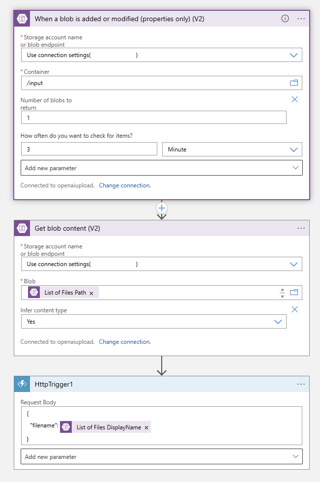

# cj-openai-runtime-update

Code repo for a python file script that can take a file from an Azure Storage Account, break a pdf into individual pages, run form rec across it and then update a search index.

Expectation is that the openai demo has already been deployed and this hangs off all that.

In the main python file you need to update the following variables:

    connection_string = "STORAGE ACCOUNT CONNECTION STRING"
    input_container_name = "input"
    output_container_name = "content"
    #filename = ""
    filename = req_body.get('filename')
    category = "CHOOSE WHAT CATEGORY THE INDEX WILL CONNECT TOO, CAN BE NULL"
    searchservice = "NAME OF THE SEARCH SERVICE"
    searchkey = "SEARCH SERVICE KEY"
    search_creds = AzureKeyCredential(searchkey)
    index = "INDEX THAT WAS CREATED AS PART OF ORIGINAL DEPLOYMENT"
    formrecognizerkey = "FORM RECOGNIZER KEY"
    formrecognizerservice = "FORM RECOGNIZER SERVIICE"
    formrecognizer_creds = AzureKeyCredential(formrecognizerkey)

Local pre-reqs for all this:

Visual Studio Code
Azure Functoin Tools - version 4
Python 3.10
Fucntion Apps Extension
Logic Apps Extenson
Azure Storage Explorer

Azure Target pre-reqs:

Deploy the OpenAI demo to get the basics in place
Deploy a logic app
Deploy a function app into a different RG; stack would be python 3.10

Logic App needs to look like this:

