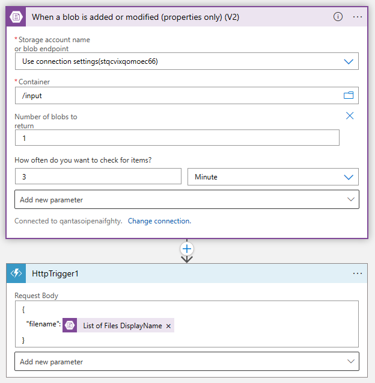

# cj-openai-runtime-update

## Features

Code repo for a python file script that can take a file from an Azure Storage Account, break a pdf into individual pages, run form recognizer across it and then update a search index ready for OpenAI to query.

Expectation is that the openai demo has already been deployed and this hangs off all that.

### Local Prerequisites

Local pre-reqs for all this:

* Visual Studio Code https://code.visualstudio.com/
* Azure Function Tools - version 4 https://learn.microsoft.com/en-us/azure/azure-functions/functions-run-local?tabs=v4%2Cwindows%2Ccsharp%2Cportal%2Cbash
* Python 3.10 https://www.python.org/downloads/windows/
* Azure Storage Explorer https://azure.microsoft.com/en-us/products/storage/storage-explorer/

#### Visual Studio Code Extensions

* Function Apps
* Logic Apps
* Python

### Azure Prerequisites

* Deploy the OpenAI demo to get the basics in place - https://github.com/Azure-Samples/azure-search-openai-demo

Recommend that you used codespaces for this...as they are excellent.

Steps for this are:

* Fork the repo to your own GitHub
* Update the docs that are in there to be ones relevant for your own demo
* Modify the sample questions shown app/frontend/src/components/Example/ExampleList.tsx with customer-specific questions
* Run codespaces from your repo
* Follow the original instructions except you need to copy your repo into the codespaces - azd init -t <Your GitHub>/<Your forked repo>

## Things to Change - Python
    
Once the OpenAI demo has been deployed you will have some of the components in play:

* Azure Form Recognizer; you will need its name and key
* Azure Search Indexer; you will need its name and key
* Storage Account; you will need the connection string and you will need to create a new container; for the code sample it is called Input

In the main python file you need to update the following variables:

    connection_string = "STORAGE ACCOUNT CONNECTION STRING"
    category = "CHOOSE WHAT CATEGORY THE INDEX WILL CONNECT TOO, CAN BE NULL"
    searchservice = "NAME OF THE SEARCH SERVICE"
    searchkey = "SEARCH SERVICE KEY"
    index = "INDEX THAT WAS CREATED AS PART OF ORIGINAL DEPLOYMENT"
    formrecognizerkey = "FORM RECOGNIZER KEY"
    formrecognizerservice = "FORM RECOGNIZER SERVIICE"

Test the function app locally; all things being equal it should grab a file from the input container (use Azure Storage Explorer to put it there), split it into a bunch of PDFs in the content container that the demo OpenAI deploy created, and then index it ready for OpenAI to search. When you run the HttpTrigger locally change the body of the trigger to { "filename": "<NAME OF UPLOADED DOCUMENT>.pdf" }
    
## Things to Change - Azure
    
For the rest of the Azure components you will need to make it work end to end in Azure:

* Create a new resource group
* Deploy a Function App with the Python Stack and version 3.10 of Python into the new RG
* Deploy from Visual Studio Code deploy the function app to the Azure Function App
    
You can test the funciton by running the code; first upload a file to the input directory, and then put the following in the body response:
    
   {
    "filename": "<NAME OF FILE UPLOADED TO INPUT CONTAINER>"
    } 
    
* Deploy a Logic App into the new RG

Logic App needs to look like this:

    
Test by uploading another file to the input container; again, all things being equal it will grab that file and do the needful so that in about 90 seconds OpenAI can query the new data.
    
## Azure KeyVault Enhancements

Of course having secrets and things in raw code isn't good practice, so the following changes can be made to extract the secrets from the code and put in an Azure KeyVault.
    
As I don't like repeating myself, or others, this is a really good intro on how to use Azure Functions with a Key Vault:
    
  https://servian.dev/accessing-azure-key-vault-from-python-functions-44d548b49b37
    
Follow that to setup the KeyVault and understand how to put the variables in the Applicaiton Settings on the funciton. You just then need to change the variables to be whatever you made them in KeyVault. My examples are below:
    
    connection_string = os.getenv('connectionstringfromKV')
    searchservice = os.getenv('searchservicefromKV')
    searchkey = os.getenv('searchkeyfromKV')
    index = os.getenv('indexfromKV')
    formrecognizerkey = os.getenv('formrecognizerkeyfromKV')
    formrecognizerservice = os.getenv('formrecognizerservicefromKV')
    
This will then allow you to secure the keys and the like in a KeyVault, which also makes it easier to change the back end resources as you do it in the Secrets rather than the code.
    

